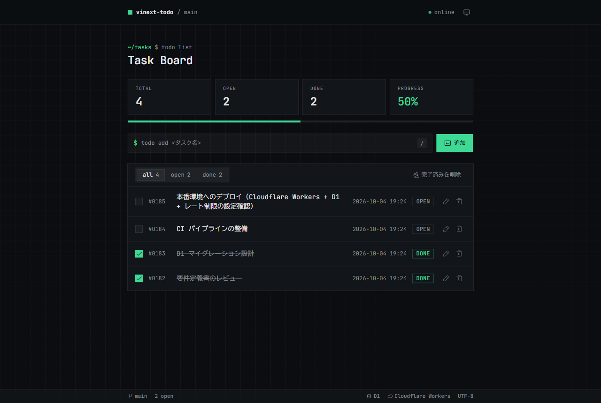
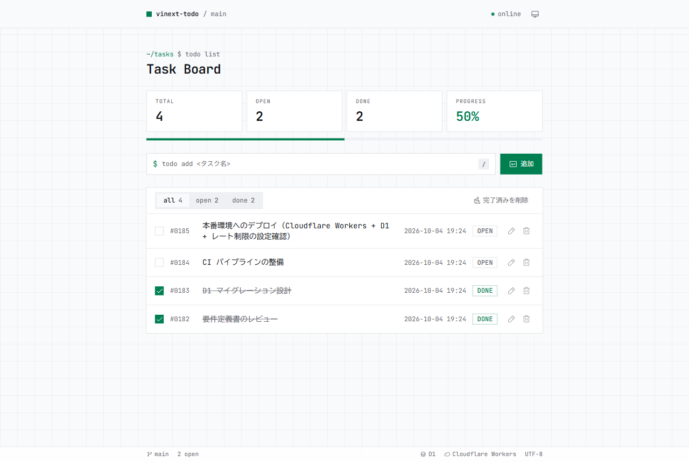
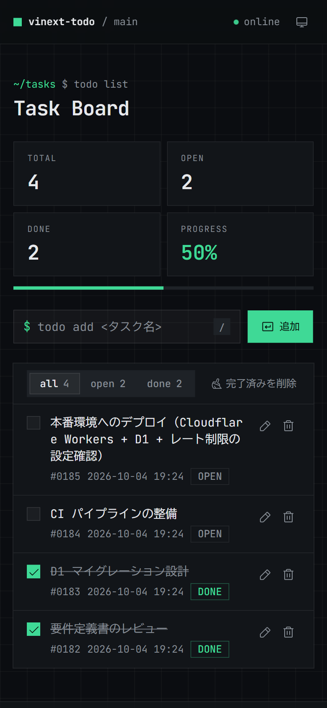
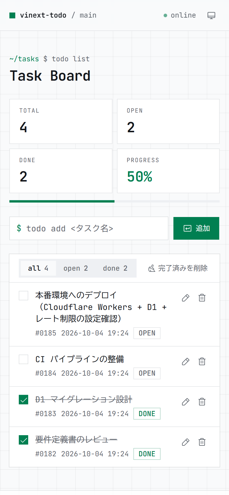

# vinext-todo

[vinext](https://github.com/cloudflare/vinext)（Next.js の API を Vite 上で再実装したもの）で作った Todo アプリです。Cloudflare Workers で動き、データは Cloudflare D1 に保存します。

**公開 URL: https://vinext-todo.katzedaze.workers.dev**



| ライトテーマ                               | スマートフォン（ダーク）                                   | スマートフォン（ライト）                                    |
| ------------------------------------------ | ---------------------------------------------------------- | ----------------------------------------------------------- |
|  |  |  |

## 機能

- タスクの追加・完了切り替え・削除、完了済みタスクの一括削除
- タスク名の編集（ダブルクリックか鉛筆ボタン。Enter で保存、Esc で取り消し）
- all / open / done のフィルタと、件数・完了率の表示
- 作成日時は東京時間（Asia/Tokyo、UTC+9）で表示
- ライト／ダークテーマ（初期値は OS の設定に従い、右上のボタンで切り替え）
- `/` キーで入力欄にフォーカス（PC のみ）
- 操作は楽観的更新で即座に画面へ反映し、裏で D1 に保存。失敗したら元に戻してエラーを表示

## 公開に向けた安全対策

ログインのない公開アプリなので、次の対策を入れています。

| 対策               | 内容                                                                                                                                                                                                 |
| ------------------ | ---------------------------------------------------------------------------------------------------------------------------------------------------------------------------------------------------- |
| 訪問者ごとのリスト | 最初の追加時にランダムな ID（UUID）を httpOnly / Secure / SameSite=Lax の Cookie で発行し、リストを訪問者ごとに分ける。D1 には ID の SHA-256 ハッシュだけを保存する                                  |
| レート制限         | 更新系の操作は IP ごとに 60 秒あたり 30 回まで（Workers Rate Limiting）                                                                                                                              |
| 件数の上限         | 1 人あたり 100 件まで。件数確認と追加を 1 つの SQL で行い、同時に送っても超えない                                                                                                                    |
| 未使用データの削除 | 90 日間使われていない訪問者のタスクを自動で削除する（更新操作の 1% で掃除を実行）。閲覧も利用に数えるが、閲覧では新しい訪問者を登録しないので、偽の Cookie で行を増やせない                          |
| CSRF               | vinext が Server Action ごとに Origin を検証し、Cookie も SameSite=Lax                                                                                                                               |
| CSP                | リクエストごとの nonce を使う CSP（`strict-dynamic`）で、nonce のないスクリプトは実行させない。あわせて `X-Content-Type-Options: nosniff` と `Referrer-Policy` を付け、iframe への埋め込みも禁止する |
| 入力チェック       | タイトルは 1〜200 文字、ID は正の整数のみ。Server Action 側で必ず検証する                                                                                                                            |

Cookie を消すとリストにアクセスできなくなります（別の端末とも共有されません）。90 日間アクセスがないとデータは削除されます。チームだけで使いたい場合は、[Cloudflare Access](https://developers.cloudflare.com/cloudflare-one/policies/access/) を Worker の前に置くと、コードを変えずにログインを必須にできます。

## 技術構成

| 領域           | 採用技術                                                                                                |
| -------------- | ------------------------------------------------------------------------------------------------------- |
| フレームワーク | vinext（Next.js App Router 互換）+ Vite 8                                                               |
| UI             | React 19、shadcn/ui（Radix / Lyra プリセット）、Tailwind CSS v4、Phosphor Icons                         |
| データ         | Cloudflare D1（マイグレーションで管理）、Workers Rate Limiting                                          |
| 実行環境       | Cloudflare Workers                                                                                      |
| 品質           | TypeScript、ESLint、Prettier、Vitest（+ Miniflare の D1）、Playwright、husky + lint-staged + commitlint |
| 運用           | GitHub Actions（CI・自動デプロイ）、Dependabot                                                          |

依存パッケージはすべて正確なバージョンで固定しています（`pnpm-workspace.yaml` の `savePrefix: ""`）。更新は Dependabot が週 1 回 Pull Request で提案します。GitHub Actions のアクションもコミット SHA で固定しています（タグの付け替えによる差し替えを防ぐため）。

## ディレクトリ構成

```
app/
  page.tsx               トップページ（Server Component。Cookie の訪問者 ID で D1 から一覧を取得）
  actions.ts             Server Actions（追加・編集・切り替え・削除）
  error.tsx              読み込みエラー時の画面
  not-found.tsx          404 画面
  _components/           画面部品（入力フォーム、統計、一覧、テーマ切り替え）
components/ui/           shadcn/ui のコンポーネント
lib/
  todo-repository.ts     D1 への読み書き（D1Database を引数で受け取る）
  owner.ts               訪問者 ID の Cookie 発行とハッシュ化
  cloudflare.ts          バインディング（DB、レート制限）への入口
  time.ts / theme.ts     東京時間の整形、テーマの判定
  validation.ts          入力チェック
  csp.ts                 Content-Security-Policy の組み立て
migrations/              D1 のマイグレーション（SQL）
scripts/d1-migrate.ts    マイグレーションの適用スクリプト
tests/ e2e/              ユニットテスト（Server Actions）と E2E テスト
cloudflare.config.ts     Worker とバインディングの設定
proxy.ts                 リクエストごとに CSP の nonce を発行し、セキュリティヘッダーを付ける
```

## ローカル開発

Node.js 24 以上と pnpm が必要です。ローカルでは D1 とレート制限がエミュレートされるため、Cloudflare アカウントがなくても動きます。

```bash
pnpm install
pnpm db:migrate:local   # ローカルの D1 にテーブルを作る（初回、マイグレーション追加時、.env の D1_DATABASE_ID を変えたとき）
pnpm dev                # 開発サーバー（HMR あり）
```

| コマンド                 | 内容                                               |
| ------------------------ | -------------------------------------------------- |
| `pnpm dev`               | 開発サーバーを起動                                 |
| `pnpm build`             | 本番用にビルド                                     |
| `pnpm start`             | ビルド結果をローカルの workerd で確認              |
| `pnpm db:migrate:local`  | ローカルの D1 にマイグレーションを適用             |
| `pnpm db:migrate:remote` | 本番の D1 にマイグレーションを適用                 |
| `pnpm typecheck`         | Worker の型を生成して型チェック                    |
| `pnpm test`              | ユニットテスト（Vitest）                           |
| `pnpm test:coverage`     | カバレッジ付きでユニットテスト（80% 未満で失敗）   |
| `pnpm test:e2e`          | E2E テスト（Playwright。先に `pnpm build` が必要） |
| `pnpm lint`              | ESLint で静的解析                                  |
| `pnpm format`            | Prettier で整形（`pnpm format:check` は確認のみ）  |
| `pnpm run deploy`        | Cloudflare Workers へデプロイ                      |

### テスト

- **ユニットテスト**: D1 への読み書きは Miniflare で作ったメモリ上の D1 に `migrations/` を適用して確かめます。Server Actions は Cookie やバインディングをモックして確かめます。
- **E2E テスト**: ビルドした Worker をローカルの workerd で動かし、PC（Desktop Chrome）とスマートフォン（Pixel 7）の 2 種類の画面で主要な操作を確かめます。テストごとに別のブラウザコンテキストを使うので、訪問者ごとのリストがそのままテスト同士の独立になります。初回は `pnpm exec playwright install chromium` でブラウザを入れてください。

### スキーマを変えるとき

```bash
pnpm exec cf d1 migrations create <変更内容>   # migrations/ に空の SQL ができる
pnpm db:migrate:local
```

## Git フック（husky）

`pnpm install` で husky が有効になり、次のフックが動きます。

- **pre-commit**: lint-staged でステージしたファイルに `eslint --fix` と `prettier --write` をかけ、続けて `pnpm typecheck` と `pnpm test`
- **commit-msg**: commitlint で [Conventional Commits](https://www.conventionalcommits.org/ja/) 形式か確認（例: `feat: タスクの並び替えを追加`）

## Cloudflare へのデプロイ

### 1. Cloudflare にログインする

```bash
pnpm exec cf auth login
```

ブラウザが開くので、Cloudflare アカウントで承認します。CI など対話できない環境では、代わりに環境変数 `CLOUDFLARE_API_TOKEN` と `CLOUDFLARE_ACCOUNT_ID` を設定します（API トークンの作り方は後述）。

### 2. D1 データベースを作る

```bash
pnpm exec cf d1 create --name vinext-todo-db
```

`.env.example` を `.env` にコピーし、出力された `uuid` とアカウント ID を書きます。`.env` は `.gitignore` で除外しているので、GitHub にはアップロードされません。

```bash
cp .env.example .env
```

```ini
D1_DATABASE_ID=<出力された uuid>
CLOUDFLARE_ACCOUNT_ID=<アカウント ID>
```

`cloudflare.config.ts` は起動時に `.env` を読み込みます。すでに環境変数として設定されている値（CI のシークレットなど）は上書きしません。`D1_DATABASE_ID` が未設定の間は仮の ID を使うので、ローカル開発はできますが、本番へのマイグレーションとデプロイはできません。

### 3. テーブルを作る

```bash
pnpm db:migrate:remote
```

### 4. デプロイする

```bash
pnpm run deploy
```

アカウントで初めて Workers を公開するときは、先にダッシュボードの **Workers & Pages** で workers.dev のサブドメインを登録しておく必要があります（未登録だとデプロイが失敗します）。

ビルドしてから Workers へアップロードします。完了すると `https://vinext-todo.<サブドメイン>.workers.dev` で公開されます。

> レート制限の `namespace`（`cloudflare.config.ts` の `"1001"`）はアカウント内で一意な整数です。同じアカウントで別のアプリが同じ値を使っている場合は変えてください。

## GitHub Actions

| ワークフロー             | タイミング                          | 内容                                                                      |
| ------------------------ | ----------------------------------- | ------------------------------------------------------------------------- |
| `CI`（`ci.yml`）         | `main` への push、Pull Request      | Lint、整形チェック、型チェック、ユニットテスト（カバレッジ）、ビルド、E2E |
| `Deploy`（`deploy.yml`） | `main` の CI 成功後、または手動実行 | 本番 D1 へのマイグレーション適用と Cloudflare Workers へのデプロイ        |

### 自動デプロイの準備

1. 上の「Cloudflare へのデプロイ」の手順 3 まで済ませ、本番の D1 にテーブルを作っておきます。
2. [API トークンの作成画面](https://dash.cloudflare.com/profile/api-tokens)で **Edit Cloudflare Workers** テンプレートからトークンを作ります。権限に D1 の編集が含まれていなければ追加してください。
3. GitHub リポジトリの **Settings → Environments** で `production` 環境を作り、次のシークレットを登録します。

| シークレット            | 値                                                                                 |
| ----------------------- | ---------------------------------------------------------------------------------- |
| `CLOUDFLARE_API_TOKEN`  | 手順 2 で作った API トークン                                                       |
| `CLOUDFLARE_ACCOUNT_ID` | アカウント ID（ダッシュボードの URL `dash.cloudflare.com/<アカウント ID>` の部分） |
| `D1_DATABASE_ID`        | `.env` と同じ D1 データベース ID                                                   |

以降は `main` に push して CI が通ると、自動でデプロイされます。

## 注意

- vinext は開発途中のプロジェクトで、Next.js のすべての機能を再現しているわけではありません。詳しくは [vinext の README](https://github.com/cloudflare/vinext#project-status) を参照してください。
- **Server Component から `components/ui/button` などの shadcn/ui コンポーネント（`radix-ui` を読み込むもの）を import すると、vinext 1.0.1 では本番ビルドが RSC の変換中に止まります。** Client Component（`"use client"`）から使う分には問題ありません。`app/not-found.tsx` はこのためボタン風のリンクを Tailwind のクラスで直接作っています。
- フォント（JetBrains Mono のラテン文字部分）は `app/fonts/` に同梱し、`next/font/local` で読み込んでいます（ライセンスは同じフォルダの `OFL.txt`）。vinext の `next/font/google` は、ビルド時に Google Fonts を取得できないと黙って CDN 読み込みに切り替わり、CSP に止められるためです。
- `app/` の中にテストファイルを置かないでください。ユニットテストは `lib/` か `tests/` に置きます。
